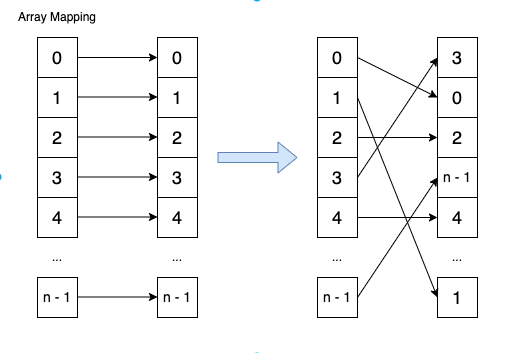

- [Overview](#overview)
- [Array Mapping](#array-mapping)

# Overview
This concerns algorithms and techniques within array data structures.

# Array Mapping
.

This algorithm is applicable in the following scenario:
1. To maintain element consistency.