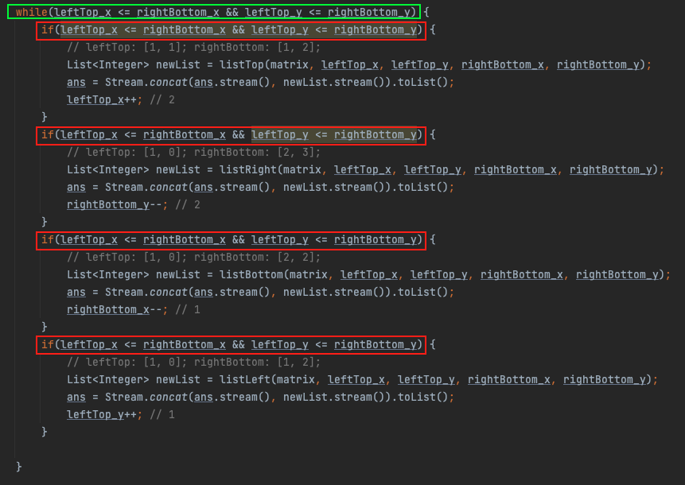

- [Overview](#overview)
- [Caveats](#caveats)
  - [Redundant Conditional Checking](#redundant-conditional-checking)

# Overview

# Caveats
## Redundant Conditional Checking
If the while loop has multiple parts, the condition needs to be redundantly checked within each part of the loop's body due to:
   1. **Sequential Execution**: Each part is executed within the loop sequentially.
   2. **Dynamic Variable Updates**: Since conditional variables will be updated within each part, it is necessary to reevaluate the condition before proceeding to the next part.

